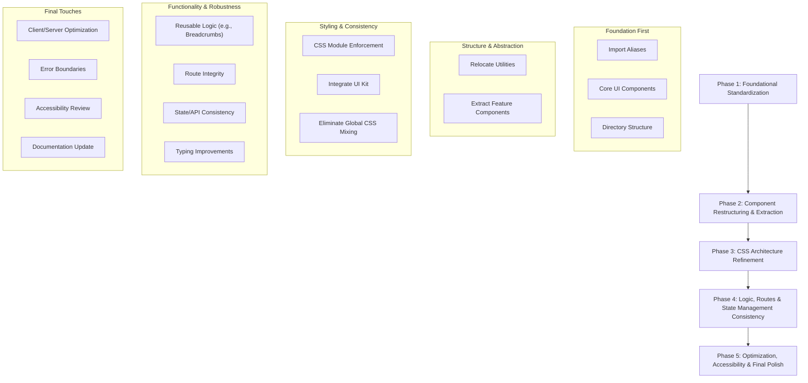
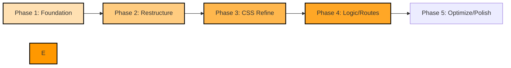

Of course. Here is the instruction rewritten with the manual line numbers removed.

---
# Teacherly AI Frontend Refactoring Implementation Plan

## 🎯 Executive Summary

This implementation plan addresses the critical structural issues, inconsistencies, and deviations from best practices identified in the Teacherly AI frontend codebase. The plan is designed with **zero-conflict phases** that build upon each other systematically. Each step aims to create a stable foundation for the next, ultimately leading to a more maintainable, scalable, and robust frontend architecture that aligns with documented guidelines and industry best practices.

## 📋 Phase Overview & Dependencies

The refactoring process is broken down into five distinct phases, ensuring that foundational changes are made before more complex restructuring and styling efforts.



---

## 🔥 Phase 1: Foundational Standardization (Days 1-3)
**Priority: CRITICAL** | **Conflicts: Minimal (primarily affects import paths & new, unused files)** | **Duration: 3 days**

### Objectives
- Standardize all import paths to use configured `@/` aliases.
- Create essential missing core UI components (`Button`, `Card`, `Breadcrumb`).
- Establish and clean up the component directory structure as per guidelines.

### Tasks

#### Day 1: Import Path Standardization ✅ Done
**Target:** Entire codebase (`src/`).
**Issue Ref:** Consolidated Analysis I.A.

**Specific Implementation:**
1.  **Audit import paths:** Identify all instances of relative imports that should be aliases (e.g., `../components/`, `../../lib/`).
2.  **Systematic Replacement:** Use find/replace tools or IDE features to convert relative paths to aliases.
    *   Example for `../components/` to `@/components/`:
        ```bash
        # (Carefully test this command, backup before running broadly)
        # find src -name "*.tsx" -exec sed -i 's|\.\./components|@/components|g' {} \;
        # find src -name "*.ts" -exec sed -i 's|\.\./components|@/components|g' {} \;
        ```
    *   Example for deep `lib` paths like `../../../lib/api/auth` to `@/lib/api/auth`:
        ```bash
        # (Adjust depth and paths as needed)
        # find src -name "*.tsx" -exec sed -i 's|\.\./\.\./\.\./lib|@/lib|g' {} \;
        # find src -name "*.ts" -exec sed -i 's|\.\./\.\./\.\./lib|@/lib|g' {} \;
        ```
3.  **Verify:** Ensure the application builds and runs correctly after changes.

#### Day 2: Core UI Components Creation ✅ Done
**Target Directory:** `src/components/ui/`
**Issue Ref:** Consolidated Analysis II.B (Missing `Button`), III.B (Lack of standard components).

**Specific Implementation:**
1.  **Create [`Button`](teacherly-ai/src/components/ui/Button/Button.tsx) component:**
    *   Path: `src/components/ui/Button/Button.tsx` (and `Button.module.css`, `index.ts`)
    *   Props:
        ```typescript
        interface ButtonProps extends React.ButtonHTMLAttributes<HTMLButtonElement> {
          variant?: 'primary' | 'secondary' | 'outline' | 'ghost' | 'link';
          size?: 'sm' | 'md' | 'lg' | 'icon';
          isLoading?: boolean;
          iconLeft?: React.ReactNode;
          iconRight?: React.ReactNode;
          children: React.ReactNode;
        }
        ```
2.  **Create [`Card`](teacherly-ai/src/components/ui/Card/Card.tsx) component:**
    *   Path: `src/components/ui/Card/Card.tsx` (and `Card.module.css`, `index.ts`)
    *   Props:
        ```typescript
        interface CardProps {
          title?: string;
          description?: string;
          headerActions?: React.ReactNode;
          footerContent?: React.ReactNode;
          children: React.ReactNode;
          className?: string;
        }
        ```
3.  **Create [`Breadcrumb`](teacherly-ai/src/components/ui/Breadcrumb/Breadcrumb.tsx) component:**
    *   Path: `src/components/ui/Breadcrumb/Breadcrumb.tsx` (and `Breadcrumb.module.css`, `index.ts`)
    *   Props:
        ```typescript
        interface BreadcrumbItem {
          label: string;
          href?: string;
          isCurrent?: boolean;
        }
        interface BreadcrumbProps {
          items: BreadcrumbItem[];
          separator?: React.ReactNode;
          className?: string;
        }
        ```
4.  **Styling:** Each component should have its own CSS Module.

#### Day 3: Directory Structure Establishment & Cleanup ✅ Done
**Target Directories:** `src/components/` and its subdirectories.
**Issue Ref:** Consolidated Analysis II.C, II.D, II.E.

**Specific Implementation:**
1.  **Ensure existence of standard directories:**
    ```bash
    mkdir -p src/components/features/auth
    mkdir -p src/components/features/dashboard
    mkdir -p src/components/features/generation-hub
    mkdir -p src/components/features/landing/sections
    mkdir -p src/components/features/students 
    mkdir -p src/components/common
    ```
2.  **Review and Decide:**
    *   `src/components/landing/` (currently with empty `sections/`): Confirm if it should be `src/components/features/landing/` for consistency. If so, move/rename.
    *   `src/components/layouts/` (empty): Determine its purpose. If none, remove.
    *   `src/components/common/` (empty): Prepare for components in Phase 2.
3.  **Index files:** Create/update `index.ts` in `ui/`, `common/`, and feature directories for cleaner imports.

### Success Criteria for Phase 1:
- ✅ **Done:** All project imports use `@/` aliases.
- ✅ **Done:** Core UI components (`Button`, `Card`, `Breadcrumb`) are created, functional with basic styling, and available for use.
- ✅ **Done:** Component directory structure aligns with guidelines (`ui/`, `features/`, `common/`).
- ✅ **Done:** Application builds and runs without errors related to these changes.

---

## 🔄 Phase 2: Component Restructuring & Extraction (Days 4-7)
**Priority: HIGH** | **Conflicts: Minimal (builds on Phase 1; mainly involves moving files and updating imports)** | **Duration: 4 days**

### Objectives
- Relocate misplaced utility/common components to their correct directories.
- Extract large, inline sections from page files into dedicated, reusable feature components.
- Maintain all existing functionality during refactoring.

### Tasks

#### Day 4: Relocate Utility & Common Components ✅ Done
**Target Components:** [`AnimatedElement.tsx`](teacherly-ai/src/components/AnimatedElement.tsx), [`AnimatedSection.tsx`](teacherly-ai/src/components/AnimatedSection.tsx), [`ScrollDownButton.tsx`](teacherly-ai/src/components/ScrollDownButton.tsx).
**Issue Ref:** Consolidated Analysis II.A.

**Implementation Steps:**
1.  Move `AnimatedElement.tsx` and `AnimatedSection.tsx` to `src/components/common/`.
    *   Create `src/components/common/AnimatedElement/AnimatedElement.tsx` (and CSS module if needed).
    *   Create `src/components/common/AnimatedSection/AnimatedSection.tsx` (and CSS module if needed).
2.  Move `ScrollDownButton.tsx` to `src/components/ui/ScrollDownButton/ScrollDownButton.tsx` (and CSS module).
3.  Update all import statements across the project that reference these components. Use global find/replace carefully.
    *   Example: `../components/AnimatedElement` becomes `@/components/common/AnimatedElement`.
4.  Test pages using these components (e.g., `app/page.tsx`, `dashboard/generation-hub/exam/page.tsx`).

#### Days 5-6: Extract Landing Page Feature Components
**Target File:** [`src/app/page.tsx`](teacherly-ai/src/app/page.tsx).
**Issue Ref:** Consolidated Analysis II.A.

**Extract into:** `src/components/features/landing/`
1.  **Hero Section:** Create `src/components/features/landing/HeroSection/HeroSection.tsx`. Move relevant JSX, logic, and import `styles from './HeroSection.module.css'`.
2.  **Services Section:** Create `src/components/features/landing/ServicesSection/ServicesSection.tsx`.
3.  **Testimonials Section:** Create `src/components/features/landing/TestimonialsSection/TestimonialsSection.tsx`.
4.  **Footer Section:** Create `src/components/features/landing/Footer/Footer.tsx` (or `FooterSection.tsx`).
5.  **Shared Sub-components:** If elements like `StatItem` or `ServiceCard` are complex enough, extract them into `src/components/features/landing/components/`.
6.  **Refactor `app/page.tsx`:** Replace inline JSX with imported feature components. Page should become primarily a layout of these sections.

#### Day 7: Extract Generation Hub Feature Components
**Target Files:** [`src/app/dashboard/generation-hub/exam/page.tsx`](teacherly-ai/src/app/dashboard/generation-hub/exam/page.tsx), and [`material/page.tsx`](teacherly-ai/src/app/dashboard/generation-hub/material/page.tsx) if similar.
**Issue Ref:** Consolidated Analysis II.A.

**Extract into:** `src/components/features/generation-hub/`
1.  **Exam Form:** Create `src/components/features/generation-hub/ExamForm/ExamForm.tsx`. Move form JSX, state (`formData`, `handleChange`, `handleSubmit`), and related logic from `exam/page.tsx`. It will use its own `ExamForm.module.css`.
2.  **Material Form (if applicable):** If `material/page.tsx` has a similar large form, create `src/components/features/generation-hub/MaterialForm/MaterialForm.tsx`.
3.  **Refactor Page Files:** `exam/page.tsx` (and `material/page.tsx`) should import and render the new form components. They will still handle breadcrumbs (until Phase 4) and page layout.

### Success Criteria for Phase 2:
- ✅ `AnimatedElement`, `AnimatedSection`, `ScrollDownButton` are in their correct new locations and all imports are updated.
- ✅ Landing page (`app/page.tsx`) is significantly smaller, composed of imported feature sections.
- ✅ Exam generation page (`exam/page.tsx`) uses an imported `ExamForm` component.
- ✅ All affected pages render and function identically to before the refactor.
- ✅ No broken import paths.

---

## 🎨 Phase 3: CSS Architecture Refinement (Days 8-10)
**Priority: HIGH** | **Conflicts: Minimal (targets styling of components refactored in Phase 2)** | **Duration: 3 days**

### Objectives
- Enforce consistent CSS Module usage for all components.
- Eliminate mixed styling approaches (global CSS vs. Modules in same component).
- Replace ad-hoc styling with newly created/standardized UI components from Phase 1.
- Ensure feature-specific styles are co-located or properly scoped.

### Tasks

#### Day 8: CSS Module Enforcement & Audit
**Target:** All components, especially those modified or created in Phase 1 & 2.
**Issue Ref:** Consolidated Analysis III.A.

**Implementation Steps:**
1.  **Audit:** Systematically review all components. Ensure each has its own `.module.css` file and imports styles correctly (e.g., `import styles from './MyComponent.module.css'`).
2.  **Isolate Styles:** For pages like `exam/page.tsx` that were using `dashboard.module.css` for form elements, ensure the extracted `ExamForm.tsx` now uses its own `ExamForm.module.css` for all its specific styles.
3.  **CSS Variable System (Optional but Recommended):** If not already in place, define key theme variables (colors, spacing, typography) in `globals.css` within `:root {}` and use `var(--my-variable)` in CSS Modules for consistency.

#### Day 9: Integrate Core UI Components & Replace Ad-hoc Styles
**Target:** Pages and components using custom button/card styling, especially `app/page.tsx`, `app/dashboard/generation-hub/exam/page.tsx`, `app/auth/...` pages.
**Issue Ref:** Consolidated Analysis III.B, III.A.

**Implementation Steps:**
1.  **Buttons:** Replace all instances of custom-styled buttons (e.g., `<a>` tags styled as buttons, buttons with inline SVGs and custom classes) with the new `<Button variant="..." />` component from Phase 1.
    *   Example in `app/page.tsx` (hero button, sign-in/join).
    *   Example in `exam/page.tsx` (submit button).
2.  **Cards:** Where appropriate, refactor sections using generic `divs` styled as cards to use the new `<Card />` component. This may apply to sections in `app/dashboard/page.tsx` or feature cards.
3.  **Test:** Verify visual consistency and interactivity of replaced elements.

#### Day 10: Eliminate Global/Utility Class Mixing
**Target:** Primarily [`src/app/page.tsx`](teacherly-ai/src/app/page.tsx) (e.g., `stat-value`, `stat-label`, `btn`, `btn-primary`, `container`).
**Issue Ref:** Consolidated Analysis III.A.

**Implementation Steps:**
1.  **Identify Source:** Determine if these classes come from `globals.css` or are remnants.
2.  **Strategy:**
    *   If they are truly global utilities intended for reuse, ensure they are well-defined and don't conflict with module scoping. Document their usage.
    *   If they are specific to a component's structure (even if repeated), move those styles into the respective component's CSS Module. For `app/page.tsx`, these styles would go into the CSS modules of the extracted feature sections (`HeroSection.module.css`, etc.).
3.  **Refactor:** Replace `className="global-class"` with `className={styles.moduleClass}`.

### Success Criteria for Phase 3:
- ✅ Every component uses its own CSS Module for its specific styles.
- ✅ Ad-hoc button/card styles are replaced by the standardized `Button` and `Card` UI components.
- ✅ Mixing of global CSS classes and CSS Modules within component rendering is eliminated or clearly justified and documented.
- ✅ Visual appearance and responsiveness are maintained or improved.
- ✅ The exam form and other extracted features use their own dedicated CSS modules, not shared page-level ones like `dashboard.module.css`.

---

## 🔧 Phase 4: Logic, Routes & State Management Consistency (Days 11-14)
**Priority: MEDIUM** | **Conflicts: Low (builds on well-structured and styled components from previous phases)** | **Duration: 4 days**

### Objectives
- Eliminate duplicated UI logic by using standardized components (e.g., Breadcrumbs).
- Ensure all application routes referenced in navigation are implemented or have placeholders.
- Standardize interactions with the state management system (Redux Toolkit) and API calls.
- Improve TypeScript typing in key areas.

### Tasks

#### Day 11: Implement Reusable Breadcrumb Component
**Target:** Pages with manual breadcrumb implementations (e.g., [`exam/page.tsx`](teacherly-ai/src/app/dashboard/generation-hub/exam/page.tsx:56-71), [`material/page.tsx`](teacherly-ai/src/app/dashboard/generation-hub/material/page.tsx), [`generation-hub/page.tsx`](teacherly-ai/src/app/dashboard/generation-hub/page.tsx)).
**Issue Ref:** Consolidated Analysis II.C.

**Implementation Steps:**
1.  Identify all pages with duplicated breadcrumb JSX.
2.  Refactor these pages to use the `<Breadcrumb items={...} />` component created in Phase 1.
3.  Ensure `breadcrumbItems` prop is correctly passed.

#### Day 12: Address Missing Routes & Route Integrity
**Target:** Navigation links in [`src/app/dashboard/layout.tsx`](teacherly-ai/src/app/dashboard/layout.tsx).
**Issue Ref:** Consolidated Analysis I.B.

**Implementation Steps:**
1.  For each missing route identified (e.g., `/dashboard/students`, `/dashboard/grades`, `/dashboard/settings`, `/dashboard/help`):
    *   Create the directory structure: `src/app/dashboard/students/`, etc.
    *   Create a basic `page.tsx` file in each, e.g.:
        ```typescript
        // src/app/dashboard/students/page.tsx
        export default function StudentsPage() {
          return (
            <div>
              <h1>Students Management</h1>
              <p>Content coming soon...</p>
            </div>
          );
        }
        ```
2.  Verify all links in the dashboard sidebar now navigate to a page (even if a placeholder).

#### Day 13: Standardize State Management & API Calls
**Target:** Components making direct API calls or with inconsistent state patterns (e.g., [`forgot-password/page.tsx`](teacherly-ai/src/app/auth/forgot-password/page.tsx)).
**Issue Ref:** Consolidated Analysis IV.A.

**Implementation Steps:**
1.  **Review `FRONTEND_GUIDELINES.md`:** Re-familiarize with patterns for Redux thunks, `apiClient`, and state slice structure.
2.  **Audit API Calls:** Check if components like `forgot-password/page.tsx` should dispatch a Redux thunk instead of directly calling `requestPasswordReset` from `auth.ts`. If the operation involves global state changes or complex async logic, prefer thunks.
3.  **Loading/Error States:** Ensure components consistently select `isLoading` and `error` states from relevant Redux slices and display UI feedback accordingly. (The `forgot-password/page.tsx` seems to handle this locally, which might be acceptable if no global state is impacted).

#### Day 14: Improve TypeScript Typing
**Target:** Key components and functions identified with `any` types or incomplete interfaces.
**Issue Ref:** Consolidated Analysis V.A.

**Implementation Steps:**
1.  **Static Analysis:** Use TypeScript compiler (`tsc --noEmit`) and ESLint to identify problematic areas.
2.  **Prioritize:** Focus on widely used components, props, and state definitions.
3.  **Refactor:** Replace `any` with specific types. Define more complete interfaces for props and API responses.
    *   Example: If `apiFetchCurrentUser` in `authSlice.ts` returns a loosely typed user, ensure `User` interface is comprehensive.

### Success Criteria for Phase 4:
- ✅ Duplicated breadcrumb logic is removed and replaced with the `Breadcrumb` UI component.
- ✅ All navigation links in the dashboard sidebar lead to valid pages (placeholders are acceptable).
- ✅ API interactions and state management patterns are more consistent with `FRONTEND_GUIDELINES.md`.
- ✅ Key areas of the codebase have improved type safety.

---

## ⚡ Phase 5: Optimization, Accessibility & Final Polish (Days 15-17)
**Priority: MEDIUM-LOW** | **Conflicts: None (targets refinement of the refactored codebase)** | **Duration: 3 days**

### Objectives
- Optimize Client/Server Component usage where appropriate.
- Implement basic React Error Boundaries for improved robustness.
- Conduct a high-level accessibility review and make initial improvements.
- Update all relevant documentation (`FRONTEND_GUIDELINES.md`).

### Tasks

#### Day 15: Client/Server Component Optimization
**Target:** Pages currently marked `'use client'` that might be convertible to Server Components or have client logic isolated. E.g., [`generation-hub/page.tsx`](teacherly-ai/src/app/dashboard/generation-hub/page.tsx).
**Issue Ref:** Consolidated Analysis II.B.

**Implementation Steps:**
1.  **Review Pages:** Analyze pages like `generation-hub/page.tsx`. If its `useEffect` for `isLoaded` animation can be achieved via CSS or by wrapping only the animated part in a client component, the page itself could potentially become a Server Component.
2.  **Isolate Client Logic:** For pages that need some client interactivity but are largely static, try to move the interactive parts into smaller, dedicated Client Components, allowing the parent page to remain a Server Component.

#### Day 16: Implement Error Boundaries & Accessibility Review
**Issue Ref:** Consolidated Analysis V.B, VI.A.

**Implementation Steps:**
1.  **Error Boundaries:**
    *   Create a simple generic Error Boundary component (e.g., `src/components/common/ErrorBoundary.tsx`).
    *   Wrap key application sections:
        *   Around the `{children}` in `src/app/layout.tsx` or `src/components/ClientProviders.tsx`.
        *   Around main content areas of complex dashboards or pages.
2.  **Accessibility Review (High-Level):**
    *   **Semantic HTML:** Check major pages for use of `<div>` where `<nav>`, `<main>`, `<aside>`, `<article>`, `<section>`, `<header>`, `<footer>` would be more appropriate.
    *   **ARIA Labels:** For interactive elements without clear text (e.g., icon buttons), ensure `aria-label` is present.
    *   **Focus Management:** Basic keyboard navigation checks on forms and interactive elements.
    *   Make initial, straightforward fixes.

#### Day 17: Documentation Update & Final Review
**Target:** [`FRONTEND_GUIDELINES.md`](teacherly-ai/FRONTEND_GUIDELINES.md), project README (if applicable).

**Implementation Steps:**
1.  **Update `FRONTEND_GUIDELINES.md`:**
    *   Reflect the new UI components (`Button`, `Card`, `Breadcrumb`).
    *   Update component structure sections if decisions were made about `common/`, `landing/`, `layouts/`.
    *   Reinforce patterns established during refactoring (e.g., CSS Module usage, import aliases).
2.  **Code Review:** Conduct a final pass over the refactored areas.
3.  **Testing:** Perform a general smoke test of the application.

### Success Criteria for Phase 5:
- ✅ Client/Server component boundaries are better optimized where feasible.
- ✅ Basic Error Boundaries are in place for improved application stability.
- ✅ Initial accessibility improvements (semantic HTML, ARIA labels for key elements) are made.
- ✅ `FRONTEND_GUIDELINES.md` accurately reflects the refactored codebase structure and practices.
- ✅ Application is stable and all critical paths are functional.

---

## 🚨 Conflict Prevention Strategy

### Inter-Phase Dependencies
Each phase is designed to build upon the successful completion of the previous one. This minimizes conflicts by ensuring that foundational work (like standardized imports or core UI components) is in place before dependent tasks (like using those components or refactoring files that will have their imports changed) are undertaken.



### Conflict Avoidance Rules
1.  **Sequential Phases:** Strictly follow the phase order. Do not start tasks from a later phase before the current one is complete and verified.
2.  **Atomic Commits:** Commit changes frequently with clear messages, ideally per sub-task or logical unit of work.
3.  **Branching Strategy:** Use a dedicated feature branch for the entire refactoring effort (e.g., `refactor/frontend-architecture`). Consider sub-branches per phase if multiple developers are involved or for easier review (e.g., `refactor/phase-1-foundation`).
4.  **Pull/Merge Regularly:** If working in a team, keep the refactoring branch up-to-date with the main development branch to catch integration conflicts early (though ideally, major new features are paused on `main` during such a large refactor).
5.  **Communication:** Clear communication if multiple team members are contributing to different parts of the refactor.
6.  **Test After Each Major Change:** Verify key functionalities locally after completing significant tasks within a phase.

### Rollback Strategy
-   **Git Revert/Reset:** Use Git's capabilities to revert specific commits or reset to a known good state if a task introduces critical issues that can't be quickly resolved.
-   **Phased Branches:** If using per-phase branches, a problematic phase can be more easily isolated or rolled back without affecting prior completed phases.
-   **Prior Backups:** Ensure the codebase is backed up before starting a large refactoring effort.

---

## 📊 Success Metrics

### Phase Completion Criteria
| Phase                                                | Key Metric                                                                     | Target                                                                        |
| :--------------------------------------------------- | :----------------------------------------------------------------------------- | :---------------------------------------------------------------------------- |
| **1: Foundational Standardization**                  | Standardized Imports & Core UI                                                 | 100% alias usage; `Button`, `Card`, `Breadcrumb` created & functional.        |
| **2: Component Restructuring & Extraction**          | Components Relocated & Pages Decomposed                                        | All targeted components moved/extracted; Pages are leaner.                    |
| **3: CSS Architecture Refinement**                   | CSS Module Purity & UI Kit Integration                                         | No global/module CSS mixing; New UI components used for buttons/cards.        |
| **4: Logic, Routes & State Management Consistency** | Duplication Reduced & Routes Functional                                        | Breadcrumb component used universally; All dashboard links resolve.         |
| **5: Optimization, Accessibility & Final Polish**    | Client/Server Optimization & Docs Updated                                      | Key pages reviewed for C/S optimization; `FRONTEND_GUIDELINES.md` updated.    |

### Overall Success Indicators
- ✅ **Zero Regressions:** No existing functionality is broken by the refactoring.
- ✅ **Improved Code Readability & Maintainability:** Code is easier to understand, modify, and debug.
- ✅ **Adherence to Guidelines:** The codebase aligns with `FRONTEND_GUIDELINES.md` and established best practices.
- ✅ **Reduced Technical Debt:** Key structural issues and inconsistencies are resolved.
- ✅ **Enhanced Developer Experience:** A more consistent and predictable codebase.
- ✅ **Performance (Qualitative):** No noticeable performance degradation; potential improvements from C/S optimization.

---

## 🛠️ Implementation Tools

### Required Commands / Techniques
-   **File Navigation & Creation:**
    ```bash
    mkdir -p src/components/ui/{Button,Card,Breadcrumb}
    # etc. for other directory creations
    ```
-   **Searching for Text / Patterns:**
    ```bash
    # Find relative imports (example, adjust pattern for accuracy)
    grep -rE "from '\.\./components" src/ --include="*.tsx" --include="*.ts"
    # Find global className usage (example)
    grep -r "className=\"[a-zA-Z0-9_-]+\"" src/ --include="*.tsx" | grep -v "{styles."
    ```
-   **Find and Replace (IDE or `sed`):**
    *   For import path updates (use with caution, test thoroughly):
        ```bash
        # Example: find src -name "*.tsx" -exec sed -i 's|from "../../../lib/api/auth"|from "@/lib/api/auth"|g' {} \;
        ```
-   **Linters & Formatters:** `ESLint` (configured with `eslint-config-next`), `Prettier`. Run frequently.
    ```bash
    npm run lint -- --fix
    # or yarn lint --fix
    ```
-   **TypeScript Compiler:** Check for type errors.
    ```bash
    npm run build
    # or specifically: tsc --noEmit
    ```

### Testing Strategy
-   **Local Development Server:** Continuously run `npm run dev` and test changes in the browser.
-   **Manual Smoke Testing:** After each significant task or at the end of each day, manually test critical user flows and affected pages.
-   **Component Isolation (if Storybook/equivalent is set up):** Test new UI components in isolation.
-   **Build Verification:** Regularly run `npm run build` to catch build-time errors.
-   **Cross-browser Testing (Post-Refactor):** Perform a round of testing on major supported browsers.
-   **Code Reviews:** If possible, have another developer review changes, especially for complex phases.

This implementation plan provides a structured approach to refactoring the Teacherly AI frontend, aiming for systematic improvements while minimizing disruption.